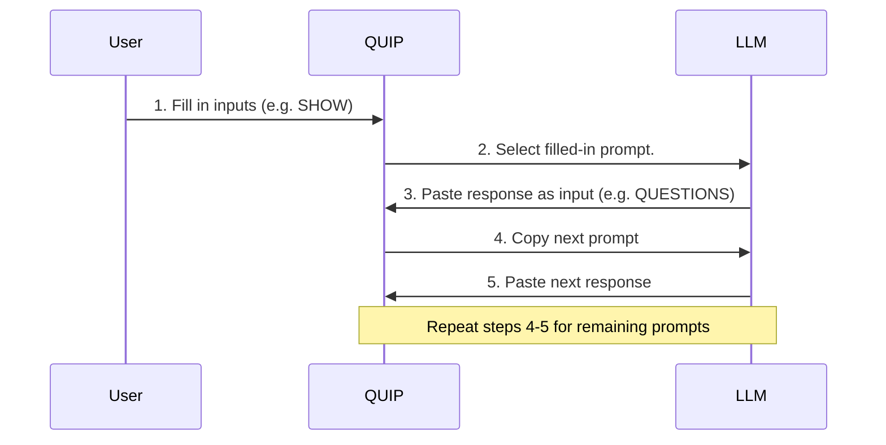

# quip - Quickly Use Interpolated Prompts 

> We interpolate prompts in ips/  
> Into standalone HTML quips  
> Till all your base are paper clips  

### Quick Start

https://yegeniy.github.io/quip/rootclaim.html?QUESTION=paper%20clips%20by%20end%20of%20year

### Instructions

1. Go to https://yegeniy.github.io/quip
2. Pick any quip. But not index.html or template.html - those are just for show.
3. Fill in inputs in the form.
4. Press tab or select the next text area. Focus on the generated, filled in, prompt and paste it into your LLM of choice.
5. Keep going back and forth between the QUIP and the LLM webpages until you get to the last textarea. The quip may have more text areas to use after the first prompt. Typically, these are used to paste in responses from the LLM.

### About

This is a tool to quip with LLMs. Until prompt engineering is a blight of the
past, quip brings just a touch more automation to today's ironically manual
process of having structured conversations with LLMs. It focuses on minimizing
the friction in creating structured, repeatable prompt sequences. The generated
prompts can be interactively pasted back-and-forth with an LLM.

- The web-based quip implementation in this repository is a very basic tool
  for generating a dynamic sequence of LLM prompts, based on user inputs and
  LLM responses.
- It focuses on creating structured, repeatable prompt sequences that are easy
  to use.

There is support only for two kinds of operations:
- `{foo}` - the default basic variable substitution.
- `{baz*}` - exploding the variable, so that for each line of `baz`, the
  template it is used in is repeated. Only supports a single exploded variable.

### Origins

The approach demonstrated in this repository originated from the first couple
of iterations of [ghostrAIder](https://yegeniy.github.io). In bash and
python, respectively. That use case was far more sophisticated than your
typical LLM prompts tend to require. If you're curious, the original
implementations do a lot more heavy lifting because they are used to work
through the LLM prompts needed to generate a novel. Spread across ten
disparate phases of varying complexity. The web-based version implemented
here is far more portable, but far less featurefull - for better or worse.

### Development

To add a new quip:

1. Create a series interpolated prompts in `ips/` using the format:
   `<name>.<ordinal>`
2. The syntax for interpolation of a variable called `FOO` is:
   - Replace: `{FOO}` (simple substitution of FOO into the prompt)
   - Explode: `{FOO*}` (prompt is repeated with each line of FOO)
3. Run `make`, to trigger `./build.sh` to regenerate the HTML files.